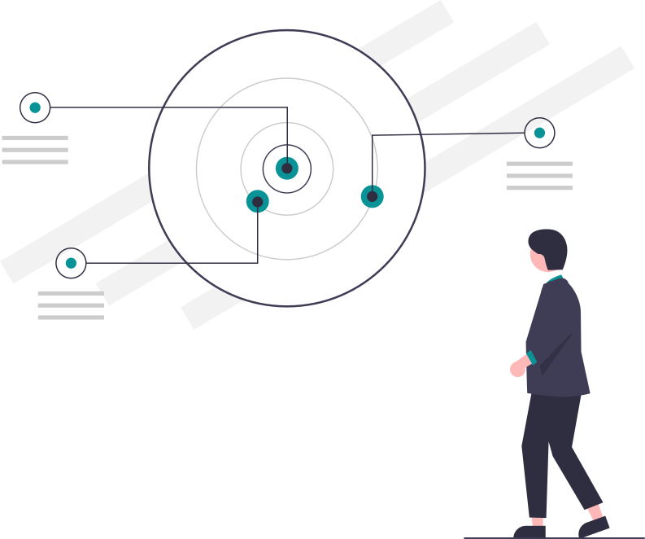
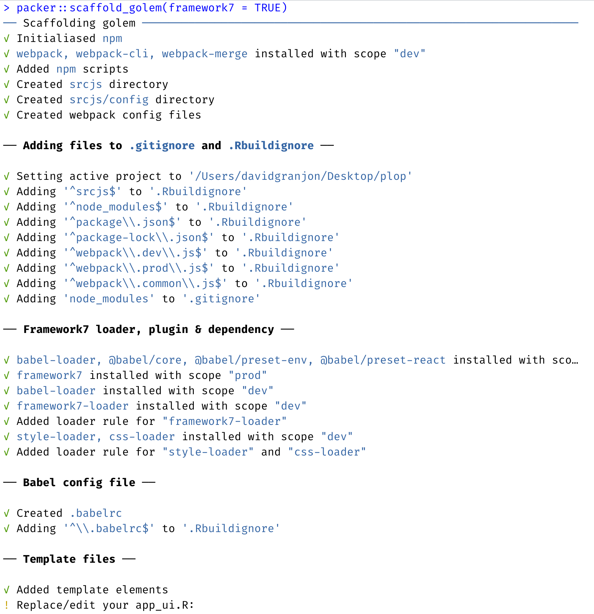
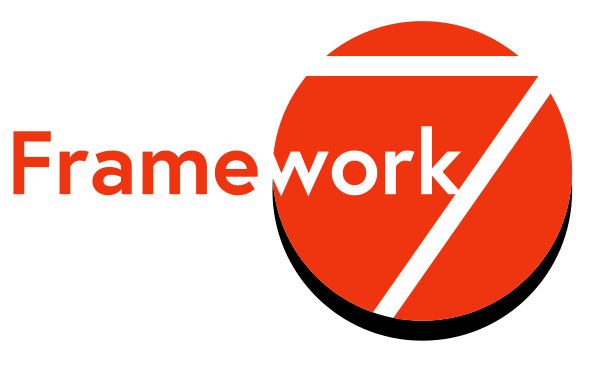
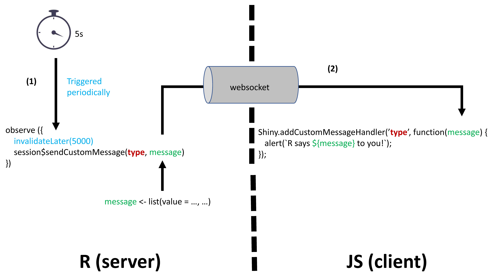

<style>
.title-slide {
  background-image: url(assets/img/bg/front_cover.jpg);
  background-size: cover;
}
</style>

```{r setup, include = FALSE}
if(!requireNamespace("emo", quietly = TRUE))
  remotes::install_github("hadley/emo")

if(!requireNamespace("xaringanExtra", quietly = TRUE))
  remotes::install_github("xaringanExtra")

library(emo)
library(shiny)
library(htmltools)
library(charpente)
library(XML)
xaringanExtra::use_xaringan_extra(c("tile_view", "animate_css", "tachyons"))
xaringanExtra::use_extra_styles(
  hover_code_line = TRUE,         #<<
  mute_unhighlighted_code = TRUE  #<<
)
xaringanExtra::use_panelset()

html_2_R <- charpente::html_2_R
```

```{r js4shiny, echo=FALSE}
js4shiny::html_setup(stylize = c("fonts", "variables", "code"))
```

# About us

.flex.tc[
.w-50.mr3[

.f5[David]

.small[Data Scientist at Novartis]

.gray[&commat;divadnojnarg]
]

.w-50.mr3[

.f5[John]

.small[Software Engineer at Opifex]

.gray[&commat;jdatap]
]

]

---

# Program

We're in for 2 hours of **fun**!

- Grab a `r ji("coffee")`
- Make yourself comfortable `r ji("couch")` or 🧘
- Ask questions `r ji("question")`  

1. Introduction 				5  min
2. Bundling with packer 15 min
3. Project Setup 				10 min
4. _Break_ 							5  min
5. Framework 7 					60 min
6. _Break_ 							5  min
7. R model 							10  min
8. Echarts.js 					(Homework)
9. Questions

---

# Workshop Material

- Slides: [rinterface.com/shiny/talks/RPharma2021](https://rinterface.com/shiny/talks/RPharma2021)

Clone this repository with the RStudio IDE or via the command line.

```shell
git clone https://github.com/RinteRface/unleash-shiny-2021.git
cd unleash-shiny-2021
```

Then run `renv::restore()` to install the dependencies.

Importantly, this workshop makes heavy use of npm (Node's Package Manager), it comes with the installation of node.js:

- You can manually install node.js: nodejs.org/en/download/.
- You can also use package managers: nodejs.org/en/download/package-manager/.

---
class: break center middle
background-image: url('assets/img/bg/intro.png')
background-size: cover

<h3 class="primary absolute bottom center">
Introduction
</h3>

---
class: header_background

# Intro

- Developing custom design for Shiny takes __too much__ time ...
- `{shinyMobile}` development `>=` 2 years ...
- What if you are already know a bit of HTML/CSS/JS?
- Relies on existing web templates to save time.
- Focus on app features.

.center[
```{r time-save, echo = FALSE, out.width='25%'}

```
]


---

# Workshop objectives

- Setup rigorous R package structure for your app with {golem}.
- Learn how to use modern web stack tools like webpack 
to maintain your R/JS package with {packer}.
- Learn how R (server) and JS (client) communicate to exchange data.
- Learn modular JavaScript basics.
- Learn basics of JSX. 
- Design awesome user interface with external template. 

.center[
```{r workshop-target, echo = FALSE, out.width='25%'}

```
]

---
class: break center middle
background-image: url('assets/img/bg/packer.png')
background-size: cover

<h3 class="primary" style="position:absolute;top:1rem;">
Managing JavaScript
</h3>

---
class: header_background

## Pre-processing JavaScript

### Why?
### What?

---

# Code Management

Large projects are complex, the developer needs help

Use something that enforces good practice and project
structure.

.pull-left[
__In R__

- Build a package
- Use [drake](https://github.com/ropensci/drake)
- Use [targets](https://github.com/wlandau/targets)

]

.pull-right[
__In JavaScript__

There is nothing such---built-in---we work with loose collections
of files.
]

---
class: center

# Browser Support

`r ji("check")` R code written in `4.0.0` will (likely) run on `3.0.0`+

`r ji("death")` JavaScript not so much.

](assets/img/es6.png)

ES6 [released June 2016](https://en.wikipedia.org/wiki/ECMAScript)

---
# Code Size

Code size matters in JavaScript: the smaller the file the faster it loads.

.pull-left[

### Input

Can be written and read by a human.

```js
function addOne(xyz){
  return xyz + 1;
}

addOne(2);
```
]

.pull-right[

###  Minified

Loads faster but can't be written or read by a human.

```js
function addOne(n){return n+1}addOne(2);
```
]

---

## Conclusion

We need to pre-process the code to:

- Minify it for performances
- Transpile to ensure it runs an (nearly) all browsers
- Be able to setup code management

It does not end here.

_Pre-processing enables even more._

---

# Dependency Management

No packages system with JavaScript but there is one
for node.js---Node's Package Manager (NPM)---that 
can be used when __preprocessing__ the code.

.pull-left[
__MANUAL__
```html
<script src="file1.js"></script>
<script src="file2.js"></script>
<script src="file3.js"></script>
```

`r ji("-1")` Difficult to manage.
]

.pull-right[
__NPM__

```bash
npm install dplyr
```

then


```js
import { mutate } from 'dplyr';
```

`r ji("+1")` Easy to manage.
]

---
class: center

## Tree-shaking

Checking for dead variables.

## Code checks

Discover errors when you write the code, not when you run it.

__And so much more...__

---
class: header_background

## Downside

1. There are a variety of tools to do the job (webpack, Grunt, Parcel, etc.)
2. They are generally difficult to set up.
3. They're not designed to work with R in mind.

---
class: center
# Meet packer!


[packer.john-coene.com](https://packer.john-coene.com/)

---
class: center, centerize
# Principles

Anything packer-related takes places in a `r ji("package")`

__Does not__ become a dependency to what you're building 

It aspires to be a specialised {[usethis](https://usethis.r-lib.org/)}:

automate tasks when building packages __with JavaScript.__
---
class: header_background

# Using packer

Set it up first.

1. Create a package (or {[golem](https://golemverse.org/)} app)
2. Scaffold 

Then write some code and bundle with `packer::bundle()`,
which produces the JavaScript code.

---
# Scaffolds?

Scaffolds are central to packer. They create the necessary structure to use webpack and npm __with R.__

- Golem - use packer with {golem}
- Htmlwidgets - use packer to create {htmlwidgets}
- Extensions - create shiny extensions (handlers)
- Inputs - create custom inputs
- Outputs - create custom outputs
- And a few more.

e.g.: 

```r
packer::scaffold_golem()
```

_The term "scaffold" was blatantly stolen from `htmlwidgets::scaffoldWidget`._

---

# Bundle?

Source code is written in `/srcjs` and is bundled to `/inst`

```r
packer::bundle()
```

---
class: break center middle
background-image: url('assets/img/bg/setup.png')
background-size: cover

<h3 class="primary absolute bottom center">
Project Setup
</h3>

---
class: header_background

# Intro

- Develop a simple app utilizing a cutting edge web template (Framework7). 
- This app will consist in:
  - A JS powered select input controlling a variable.
  - A visualization powered by `{ggplot2}` 
  - Homework: replace `{ggplot2}` by JS driven visualization. 
  
.center[
```{r work-assignement, echo = FALSE, out.width='50%'}

```
]

---

# Scaffold Framework7 🚀🚀🚀

.pull-left[
We call:

```r
packer::scaffold_golem(framework7 = TRUE)
```

Sets a Framework7 compatible structure for `{golem}`:
  - Install __npm__ dependencies.
  - JS assets folder `srcjs`.
  - __Loaders__ for CSS, JS, JSX ...
  - Config for __webpack__.
  - So that you don't have to worry too much.
]

.pull-right[
```{r framework7-assets, echo = FALSE, out.width='100%'}

```
]


---

# Test it 🥼

This is a very basic app but it works well.

```r
packer::bundle()
devtools::load_all()
run_app()
```

Bad new ... this is time for the ... 


---
class: break center middle
background-image: url('assets/img/bg/break.png')
background-size: cover

<h3 class="primary absolute bottom center">
Break!
</h3>

<p class='primary absolute white' style='bottom:2rem;'>
See you in 5 minutes.
</p>


---
class: break center middle
background-image: url('assets/img/bg/f7.png')
background-size: cover

<h3 class="primary absolute bottom center">
Framework 7
</h3>

---
class: header_background

# Intro

<br>

.pull-left[
- First class __mobile__ template for the web.
- __Native__ look and feel for iOS and Android
- Progressive web app (PWA) support.
- ... also works for desktop apps 😏
]

.pull-right[
```{r framework7-logo, echo = FALSE, out.width='100%'}

```
]


---

.pull-left[
<div class="md-iphone-5 md-black-device" id="singleLayoutDemo" style="font-size: 0.5em; margin-top: 20px; !important;">
<div class="md-body">
<div class="md-buttons"></div>
<div class="md-front-camera"></div>
<div class="md-top-speaker"></div>
<div class="md-screen">
<iframe width="100%" src="https://framework7.io/kitchen-sink/core/?theme=ios" allowfullscreen="" frameborder="0" scrolling="no" height="470px"></iframe>
</div>
<button class="md-home-button"></button>
</div>
</div>
]

.pull-right[
<div class="md-iphone-5 md-white-device" id="tabLayoutDemo" style="font-size: 0.5em; margin-top: 20px; !important;">
<div class="md-body">
<div class="md-buttons"></div>
<div class="md-front-camera"></div>
<div class="md-top-speaker"></div>
<div class="md-screen">
<iframe width="100%" src="https://appstore-f7-react.vercel.app/" allowfullscreen="" frameborder="0" scrolling="no" height="465px"></iframe>
</div>
<button class="md-home-button"></button>
</div>
</div>
]

---

# Import Framework7 and CSS 👩‍🏫

Inside the main `srcjs/framework7.js`.

.pull-left[
- Notice how CSS is imported.
- Requires style/css loaders.
- __Modular__ approach: import only what is required.
- __Lighter__ JS bundle.
- __Faster__ app.
]

.small.pull-right[
```js
// Import Framework7
import Framework7 from 'framework7';
// Import Framework7 Styles
import 'framework7/framework7-bundle.min.css';
```
]


---

# Layout basics 👩‍🏫

This part is handled by __app_ui.R__. 

.pull-left[
Framework7 requires an `index.html` script:
- `<div id="app"></div>` is the app __root__ required for initialization.
- `index.js` the script generated with `{packer}` after bundling.
- `golem_add_external_resources()` fills the `<!-- Head content ... -->` .
]

.small.pull-right[
```html
<!DOCTYPE html>
<html>
  <head>
    <!-- Head content ... -->
  </head>
  <body>
    <!-- App root element ... -->
    <div id="app"></div>
  
    <!-- Path to Framework7 JS-->
    <script type="text/javascript" src="www/index.js"></script>
  </body>
</html>
```
]

---

# App template 👩‍🏫

.pull-left[
The simplest Framework7 [layout](https://framework7.io/docs/app-layout.html) is composed of:
- The __app__ wrapper with __unique id__ required for initialization.
- A single __auto-initialized__ view.
- A page with: 
  - navbar (top).
  - toolbar (bottom).
  - page content (middle).
]

.small.pull-right[
```html
<div id="app">
  <div class="view view-main view-init safe-areas">
    <div class="page">
      <!-- navbar -->
      <!-- toolbar -->
      <div class="page-content"></div>
    </div>
  </div>
</div>
```
]

---
 
# HTML + JS: welcome JSX 👩‍🏫

__Combine__ HTML and JavaScript code in the same file.

.small.pull-left[
### Without JSX
```html
<template>
  <div class="title" innerHTML=${title}></div>
</template>
<script>
  export default (props) => {
    const title = 'Hello World';

    return $render;
  }
</script>
```

`r ji("-1")` Difficult to manage.
]

.small.pull-right[
### With JSX
```jsx
export default () => {
  const title = 'Hello World';

  return () => (
    <div class="title">{title}</div>
  )
}
```

`r ji("+1")` easy to manage.
]


---

# About Framework7 components 👩‍🏫

.pull-left[
- [Components](https://framework7.io/docs/router-component.html#component-function) have 2 default parameters:
  - __props__ gather all passed __attributes__.
  - __context__ provides access to:
    - The app instance `$f7`.
    - More [here](https://framework7.io/docs/router-component.html#component-context).
- Components:
  - must return a __render__ function. 
  - can be self-closed.
]

.small.pull-right[
```html
<Component user="David" id="compo"/>
```

```jsx
const Component = (props, context) {
  const greetings = 'Hello ' + props.user;
  
  // render function
  return () => (
    <h1>{greetings}</h1>
  )
}
```
]

---

# Main app component 👩‍🏫

`{packer}` created `app.f7.jsx`.

.pull-left[
- The whole app can be a [component](https://framework7.io/docs/router-component.html#main-app-component)!
- Very similar to other tools like [React](https://en.reactjs.org/) or [Vue](https://vuejs.org/).
] 

.xsmall.pull-right[
```jsx
export default (props, { $f7 }) => {
  const title = 'Hello World';
  
  return () => (
    <div id="app">
      <div class="view view-main view-init safe-areas">
        <div class="page">
          <!-- navbar ... -->
          <!-- toolbar ... -->
          <div class="page-content">
            <div class="block strong">
              Page Content
            </div>
          </div>
        </div>
      </div>
    </div>
  )
}
```
]


---

# Initialize App instance 👩‍🏫

The remaining of `srcjs/framework7.js`:

.pull-left[
- Initializes the app instance:
  - Targets __app__ id.
  - Sets custom theme.
  - Plugs the App component in the __component__ slot.
  - Many other options available ...
]

.pull-right[
```js
// ... Other imports ...

import App from './components/app.f7.jsx';
let app = new Framework7({
  el: '#app',
  theme: 'ios',
  // specify main app component
  component: App
});
```
]

---

# Customize app: your turn 🥼

- Within `let app = new Framework7({ ... })`:
  - Change the __theme__ to `md` (see [doc](https://framework7.io/docs/app.html#app-parameters)). 

- In `.R/app_ui.R`:
  - Add `theme-dark` class to the `body` tag.
  - Add `color-theme-***`, where `***` is a color from [here](https://framework7.io/docs/color-themes.html#colors).

---

# About the Framework7 smartSelect 👩‍🏫

It's time to add an extra component.

.pull-left[
- Improved `selectInput()`.
- Triggered by `a` element.
- `select` contains multiple `option` tags.
- `select` is followed by a label tag.
]


.xsmall.pull-right[
```html
<div class="list">
  <ul>
    <!-- Smart select item -->
    <li>
      <!-- Additional "smart-select" class -->
      <a href="#" class="item-link smart-select">
        <!-- select -->
        <select name="fruits">
          <option value="apple" selected>Apple</option>
          ...
        </select>
        <!-- Select label -->
      </a>
    </li>
  </ul>
</div>
```
]


---

# Widget element (1/5): your turn 🥼

.pull-left[
- Open `srcjs/framework7.js`.
- Between CSS import and the app initialization, add the following code.
- We also import `Sheet` since smartSelect needs it to open. 
]

.pull-right[
```js
// Install F7 Components using .use() method on class:
import Sheet from 'framework7/esm/components/sheet/sheet.js';
import smartSelect from 'framework7/esm/components/smart-select/smart-select.js';
Framework7.use([Sheet, smartSelect]);
```
]

---

# Widget element (2/5): your turn 🥼

.pull-left[
- Create a new `./srcjs/components/widget.f7.jsx` component.
- Copy the preliminary code. 
- Import it in the main app component.
- Replace __ID__ and __LABEL__ by the relevant __props__ elements.
- Don't change `data-open-in="sheet"`.
]

.xsmall.pull-right[
```jsx
export default (props, { $f7 }) => {

  return () => (
    <div class="list">
      <ul>
        <li>
          <a 
            class="item-link smart-select smart-select-init" 
            id=ID 
            data-open-in="sheet">
            <select name=ID>
              
            </select>
            <div class="item-content">
              <div class="item-inner">
                <div class="item-title">LABEL</div>
              </div>
            </div>
          </a>
        </li>
      </ul>
    </div>
  )
}
```
]


---

# Widget element (3/5): your turn 🥼

Let's add some `<option>` to the `<select>` tag...

.pull-left[
- Create a `names` array containing `wt`, `hp` and `qsec` strings.
- Map over each array element to build an `<option>` array.
- Fill in the `___`.
- Add the newly created elements to `<select>`.
]

.xsmall.pull-right[
```jsx
const names = [___];
const selectOptions = ___.map(
  (name) => {
    let isSelected = name === 'wt'? true: false;
    return(
      <option 
        key={___} 
        value={___} 
        selected={___}>
        {___}
      </option>
    );
  }
)
```

```jsx
<select name=ID>
  {___}
</select>
```
]


---

# Widget element (4/5): your turn 🥼

Let's send the selected value to Shiny.

.small.pull-left[
- Create `getSelectValue`: 
  - Give it an __id__ parameter.
  - Smart select __instance__ is recovered with `$f7.smartSelect.get()` method.
  - Smart select value obtained with `instance.getValue()`.
  - Call the relevant Shiny JS method to set the input value.
  
- In the render function:
  -  Add an `onChange` prop to the `<a>` element. 
  - Inside `onChange`, call `getSelectValue` with relevant __ID__ parameter.
  - Sends it to Shiny with `Shiny.setInputValue`. 
]

.small.pull-right[
```jsx
export default (props, { $f7 }) => {
  // Recover select value
  const getSelectValue = (id) => {
    let select = $f7.smartSelect.get('#' + ___);
    Shiny.___(___, select.getValue());
  };
  
  return () => (...)
}
```

```jsx
<a 
  class="item-link smart-select smart-select-init" 
  onChange={() => ___(ID)} 
  id=ID 
  data-open-in="sheet">
  ... // ommitted since unchanged
</a>
```
]


---

# Test it 🥼

.pull-left[
- Open `.R/app_server.R`.
- Add this code, replacing __ID__ by what you chose JS side.
- Input does not have initial value...
]

.pull-right[
```r
observeEvent(input$<ID>, {
  message(sprintf("Slider value: %s", input$<ID>))
})
```

```r
packer::bundle()
devtools::load_all()
run_app()
```
]


---

# Widget element (5/5): your turn 🥼

Give an initial value for Shiny.

.pull-left[
- Inside, `srcjs/components/widget.f7.jsx`.
- Create the `initializeWidget` helper (outside the widget component).
- Fill in the `___`.
- Call it before the render function.
]

.small.pull-right[
```js
const initializeWidget = (id) => {
  $(document).on('shiny:connected', () => {
    // initial value
    Shiny.___(
      ___, 
      $('#' + id + ' select').val(), 
      {priority: 'event'}
    );
  });
}
```
]


---

# Test it 🥼

```r
packer::bundle()
devtools::load_all()
run_app()
```

 🏆 Congrats! You designed your first component. Let's 
 improve it by adding some R logic. 


---
class: break center middle
background-image: url('assets/img/bg/break.png')
background-size: cover

<h3 class="primary absolute bottom center">
Break!
</h3>

<p class='primary absolute white' style='bottom:2rem;'>
See you in 5 minutes.
</p>


---
class: break center middle
background-image: url('assets/img/bg/model.png')
background-size: cover

<h3 class="primary absolute bottom center">
R Model
</h3>

---
class: header_background

# Intro

- Simple regression model with the `mtcars` dataset and `{ggplot2}`.
- One variable is selected from JS with newly designed custom widget.
- Formula `lm(mpg ~ input$var, mtcars)`.


---

# R business logic: your turn 🥼

.pull-left[
- Open `.R/app_server.R`.
- Fill in the `___` and `...`.
]

.pull-right[
```r
output$plot <- renderPlot({
  ggplot(
    data = ___,
    mapping = aes(x = mpg, y = .data[[___]])
  ) + 
    geom_...() + 
    geom_smooth()
})
```
]

That's all folks!


---

# Insert the plot 🥼


.pull-left[
- `output$plot` works by pair with `renderPlot("plot")` ...
- but ... we can't insert the plot as R code inside `app_ui.R`.
- Don't forget that Shiny is just creating HTML from R.
]

.pull-right[
In the R console, run:

```r
renderPlot("plot")
```

which yields:

```html
<div id="id" class="shiny-plot-output" style="width:100%;height:400px;"></div>
```

Insert this in `./srcjs/components/app.f7.jsx`. 
]


---

# Improve the design 🥼

- Explore the Framework7 __card__ container [documentation](https://framework7.io/docs/cards.html).
- Include the previous plot in the container of your choice.
- Recompile the JS code and run the app. 

.center[
```{r card-design, echo=FALSE, out.width='40%'}

```
]

---
class: break center middle
background-image: url('assets/img/bg/echarts.png')
background-size: cover

<h3 class="primary absolute bottom center">
Homework: Echarts.js
</h3>

---
class: header_background

# Intro

- Replace the previous `{ggplot2}` chart by JS code.
- We'll have to send data from R to JS.

Communication done through the __websocket__.

.pull-left[
- R side:
  - **`sendCustomMessage`** sends R messages to JS.

- JS side:
  - `Shiny.addCustomMessageHandler` receives message from `session$sendCustomMessage`.
Both are linked by the **type** parameter
]

.pull-right[
```{r from-R-to-JS, echo=FALSE, out.width='100%'}

```
]


---

# echarts assets

.pull-left[
- Install echarts and echarts-gl.
- Import JS assets in `srcjs/components/widget.f7.jsx`.
- Review the echarts [documentation](https://echarts.apache.org/examples/en/index.html).
]


.pull-right[
```r
packer::npm_install(
  c(
    "echarts", 
    "echarts-gl"
  ),
  scope = "prod"
)
```
```js
// Import plotting library
import * as echarts from 'echarts';
import 'echarts-gl';
```
]


---

# echarts plotting strategy

.pull-left[
- Create a DOM container for the plot.
- Initialize the plot container.
- Set plot options.
- Update plot instance.
]

.xsmall.pull-right[
```html
<div id="plot" style="width:100%; min-height:400px;"></div>
```

```js
let chart = echarts.init(document.getElementById('plot'));
myChartOptions = {
  title: { text: 'Plot title' },
  legend: { data:[...] },
  xAxis: { data: ...},
  yAxis: { type: ... },
  series: [
    {
      name: ...,
      type: ...,
      data: ...
    },
    // other data
  ]
};
myChart.setOption(myChartOptions);
```
]


---

# Process R data

.pull-left[
- Create a new `.R/process.R` script.
- `process_data()` selects the relevant column based on a given parameter.
- Fill in the `___`.
]

.small.pull-right[
```r
process_data <- function(parm, session = shiny::getDefaultReactiveDomain()) {
  
  data_subset <- list(mtcars$mpg, mtcars[[___]])
  names(data_subset) <- c("mpg", parm)
  
  processed_data <- list(
    data = ___,
    var = ___
  )
  
  session$sendCustomMessage("model_data", ___)
}
```
]


---

# Add Shiny

.pull-left[
- In `.R/app_server.R`, add an `observeEvent()` to trigger `process_data()` based
on the select input value (JS side).
- Comment out the old `{ggplot2}` code. 
- In `.srcjs/components/app.f7.jx`, remove the `shiny-plot-output` class from the plot container. 
]


.pull-right[
```r
observeEvent(___, {
  ___(___)
})
```
]

---

# Recover R data (1/3)

.pull-left[
- Open `srcjs/components/widget.f7.jsx`.
- Inside `initializeWidget` function:
  - Within the `shiny:connected` event listener, initialize the echarts plot instance.
  - Copy and paste the resize event to handle plot resize.
]

.small.pull-right[
```js
let plot;
$(document).on('shiny:connected', () => {
  // initial value
  
  // prepare echarts plot
  plot = echarts.___(document.getElementById(___));
});

// Resize event
$(window).on('resize', function() {
  plot.resize();
});
```
]

---

# Recover R data (2/3)

.pull-left[
- Add `Shiny.addCustomMessageHandler` to capture the message sent from R.
- A R list translates into a JS object.
- Fill in the `___`.
]


.pull-right[
```js
let plotOptions, p, data;
Shiny.addCustomMessageHandler(___, (___) => {
  p = message.var;
  data = message.___;
  
});
```
]

---

# Recover R data (3/3)

.pull-left[
- In the same message handler, set plot options.
- Apply options to the plot instance.
- Fill in the `___`.
]


.small.pull-right[
```js
plotOptions = {
  title: { text: 'Plot' },
  tooltip: {},
  legend: { data:['mpg', p] },
  xAxis: { data: message.data[___] },
  yAxis: { type: 'value' },
  series: [
    {
      name: p,
      type: 'scatter',
      data: message.data[___]
    }
  ]
}

___.setOption(___);
```
]

---
class: break center middle
background-image: url('assets/img/bg/question.png')
background-size: cover

<h3 class="primary absolute bottom center">
Questions?
</h3>

---
class: break center middle
background-image: url('assets/img/bg/undraw_winners_ao2o.svg')
background-size: cover
