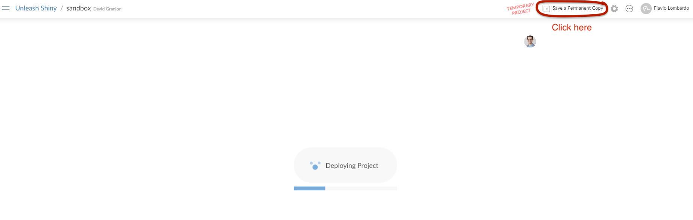

<style>
.title-slide {
  background-image: url(assets/img/bg/front_cover.jpg);
  background-size: cover;
}
</style>

```{r setup, include = FALSE}
if(!requireNamespace("emo", quietly = TRUE))
  remotes::install_github("hadley/emo")

if(!requireNamespace("xaringanExtra", quietly = TRUE))
  remotes::install_github("xaringanExtra")

library(emo)
library(shiny)
library(htmltools)
library(charpente)
library(XML)
xaringanExtra::use_xaringan_extra(c("tile_view", "animate_css", "tachyons"))
xaringanExtra::use_extra_styles(
  hover_code_line = TRUE,         #<<
  mute_unhighlighted_code = TRUE  #<<
)
xaringanExtra::use_panelset()

html_2_R <- charpente::html_2_R
```

```{r js4shiny, echo=FALSE}
js4shiny::html_setup(stylize = c("fonts", "variables", "code"))
```

# About us

.flex.tc[
.w-30.mr3[

.f5[David]

.small[Data Scientist at Novartis]

.gray[&commat;divadnojnarg]
]

.w-30.mr3[

.f5[John]

.small[Software Engineer at Opifex]

.gray[&commat;jdatap]
]

]

---

# Program

We're in for 2 hours of **fun**!

- Grab a `r ji("coffee")`
- Make yourself comfortable `r ji("couch")` or 🧘
- Ask questions `r ji("question")`  

1. Introduction 				5  min
2. Bundling with packer 10 min
3. R model 							5  min
4. Project Setup 				30 min
5. _Break_ 							5  min
6. Framework 7 					30 min
7. _Break_ 							5  min
8. Echarts.js 					15 min
9. Questions

---

# Workshop Material

- Slides: [rinterface.com/shiny/talks/RPharma2021](https://rinterface.com/shiny/talks/RPharma2021)
- For a plug and play experience, we created a [Rstudio Cloud](https://rstudio.cloud/spaces/92568/join?access_code=kqUUGAOZMMHSZoAQBrQ1GHSOBxSE4u1q8JvrJoRs) project with everything installed for you

.center[
https://rstudio.cloud/spaces/92568/join?access_code=kqUUGAOZMMHSZoAQBrQ1GHSOBxSE4u1q8JvrJoRs
]
  
- To avoid **connection issues**, disconnect from your **VPN**!
- Somes slides contain code that you may run (a **sandbox** space is available in RStudio Cloud)

```{r rstudio-cloud-init, echo=FALSE, out.width='100%'}

```

---
class: break center middle
background-image: url('assets/img/bg/intro.png')
background-size: cover

<h3 class="primary absolute bottom center">
Introduction
</h3>

---
class: header_background

# Intro

---
class: break center middle
background-image: url('assets/img/bg/packer.png')
background-size: cover

<h3 class="primary absolute bottom center">
Bundling
</h3>

---
class: header_background

# Intro

---
class: break center middle
background-image: url('assets/img/bg/model.png')
background-size: cover

<h3 class="primary absolute bottom center">
R Model
</h3>

---
class: header_background

# Intro

---
class: break center middle
background-image: url('assets/img/bg/break.png')
background-size: cover

<h3 class="primary absolute bottom center">
Break!
</h3>

<p class='primary absolute white' style='bottom:2rem;'>
See you in 5 minutes.
</p>

---
class: break center middle
background-image: url('assets/img/bg/setup.png')
background-size: cover

<h3 class="primary absolute bottom center">
Project Setup
</h3>

---
class: header_background

# Intro

---
class: break center middle
background-image: url('assets/img/bg/f7.png')
background-size: cover

<h3 class="primary absolute bottom center">
Framework 7
</h3>

---
class: header_background

# Intro

---
class: break center middle
background-image: url('assets/img/bg/break.png')
background-size: cover

<h3 class="primary absolute bottom center">
Break!
</h3>

<p class='primary absolute white' style='bottom:2rem;'>
See you in 5 minutes.
</p>

---
class: break center middle
background-image: url('assets/img/bg/echarts.png')
background-size: cover

<h3 class="primary absolute bottom center">
Echarts.js
</h3>

---
class: header_background

# Intro

---
class: break center middle
background-image: url('assets/img/bg/question.png')
background-size: cover

<h3 class="primary absolute bottom center">
Questions?
</h3>