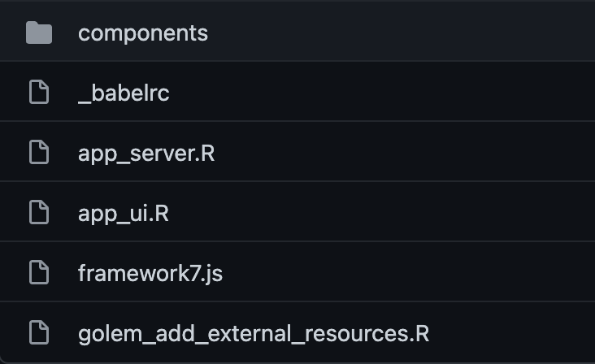

<style>
.title-slide {
  background-image: url(assets/img/bg/front_cover.jpg);
  background-size: cover;
}
</style>

```{r setup, include = FALSE}
if(!requireNamespace("emo", quietly = TRUE))
  remotes::install_github("hadley/emo")

if(!requireNamespace("xaringanExtra", quietly = TRUE))
  remotes::install_github("xaringanExtra")

library(emo)
library(shiny)
library(htmltools)
library(charpente)
library(XML)
xaringanExtra::use_xaringan_extra(c("tile_view", "animate_css", "tachyons"))
xaringanExtra::use_extra_styles(
  hover_code_line = TRUE,         #<<
  mute_unhighlighted_code = TRUE  #<<
)
xaringanExtra::use_panelset()

html_2_R <- charpente::html_2_R
```

```{r js4shiny, echo=FALSE}
js4shiny::html_setup(stylize = c("fonts", "variables", "code"))
```

# About us

.flex.tc[
.w-50.mr3[

.f5[David]

.small[Data Scientist at Novartis]

.gray[&commat;divadnojnarg]
]

.w-50.mr3[

.f5[John]

.small[Software Engineer at Opifex]

.gray[&commat;jdatap]
]

]

---

# Program

We're in for 2 hours of **fun**!

- Grab a `r ji("coffee")`
- Make yourself comfortable `r ji("couch")` or 🧘
- Ask questions `r ji("question")`  

1. Introduction 				5  min
2. Bundling with packer 10 min
3. R model 							5  min
4. Project Setup 				30 min
5. _Break_ 							5  min
6. Framework 7 					30 min
7. Echarts.js 					15 min
8. Questions

---

# Workshop Material

- Slides: [rinterface.com/shiny/talks/RPharma2021](https://rinterface.com/shiny/talks/RPharma2021)
- For a plug and play experience, we created a [Rstudio Cloud](https://rstudio.cloud/spaces/92568/join?access_code=kqUUGAOZMMHSZoAQBrQ1GHSOBxSE4u1q8JvrJoRs) project with everything installed for you

.center[
https://rstudio.cloud/spaces/92568/join?access_code=kqUUGAOZMMHSZoAQBrQ1GHSOBxSE4u1q8JvrJoRs
]
  
- To avoid **connection issues**, disconnect from your **VPN**!
- Somes slides contain code that you may run (a **sandbox** space is available in RStudio Cloud)

```{r rstudio-cloud-init, echo=FALSE, out.width='100%'}

```

---
class: break center middle
background-image: url('assets/img/bg/intro.png')
background-size: cover

<h3 class="primary absolute bottom center">
Introduction
</h3>

---
class: header_background

# Intro

- Developing custom design for Shiny takes (too much) time ...
- `{shinyMobile}` development took about 2 years ...
- What if you are already know a bit of HTML/CSS/JS?
- Relies on existing web templates to save time.
- Focus on app features.


---

# Workshop objectives

- Setup rigorous R package structure for your app with {golem}.
- Learn how to use modern web stack tools like webpack 
to maintain your R/JS package with {packer}.
- Learn how R (server) and JS (client) communicate to exchange data.
- Learn modular JavaScript basics.
- Learn basics of JSX. 
- Design awesome user interface with external template. 

---
class: break center middle
background-image: url('assets/img/bg/packer.png')
background-size: cover

<h3 class="primary" style="position:absolute;top:1rem;">
Managing JavaScript
</h3>

---
class: header_background

## Pre-processing JavaScript

### Why?
### What?

---

# Code Management

Large projects are complex, the developer needs help

Use something that enforces good practice and project
structure.

.pull-left[
__In R__

- Build a package
- Use [drake](https://github.com/ropensci/drake)
- Use [targets](https://github.com/wlandau/targets)

]

.pull-right[
__In JavaScript__

There is nothing such---built-in---we work with loose collections
of files.
]

---
class: center

# Browser Support

`r ji("check")` R code written in `4.0.0` will (likely) run on `3.0.0`+

`r ji("death")` JavaScript not so much.

](assets/img/es6.png)

ES6 [released June 2016](https://en.wikipedia.org/wiki/ECMAScript)

---
# Code Size

Code size matters in JavaScript: the smaller the file the faster it loads.

.pull-left[

### Input

Can be written and read by a human.

```js
function addOne(xyz){
  return xyz + 1;
}

addOne(2);
```
]

.pull-right[

###  Minified

Loads faster but can't be written or read by a human.

```js
function addOne(n){return n+1}addOne(2);
```
]

---

## Conclusion

We need to pre-process the code to:

- Minify it for performances
- Transpile to ensure it runs an (nearly) all browsers
- Be able to setup code management

It does not end here.

_Pre-processing enables even more._

---

# Dependency Management

No packages system with JavaScript but there is one
for node.js---Node's Package Manager (NPM)---that 
can be used when __preprocessing__ the code.

.pull-left[
__MANUAL__
```html
<script src="file1.js"></script>
<script src="file2.js"></script>
<script src="file3.js"></script>
```

`r ji("-1")` Difficult to manage.
]

.pull-right[
__NPM__

```bash
npm install dplyr
```

then


```js
import { mutate } from 'dplyr';
```

`r ji("+1")` Easy to manage.
]

---
class: center

## Tree-shaking

Checking for dead variables.

## Code checks

Discover errors when you write the code, not when you run it.

__And so much more...__

---
class: header_background

## Downside

1. There are a variety of tools to do the job (webpack, Grunt, Parcel, etc.)
2. They are generally difficult to set up.
3. They're not designed to work with R in mind.

---
class: center
# Meet packer!


[packer.john-coene.com](https://packer.john-coene.com/)

---
class: center, centerize
# Principles

Anything packer-related takes places in a `r ji("package")`

__Does not__ become a dependency to what you're building 

It aspires to be a specialised {[usethis](https://usethis.r-lib.org/)}:

automate tasks when building packages __with JavaScript.__
---
class: header_background

# Using packer

Set it up first.

1. Create a package (or {[golem](https://golemverse.org/)} app)
2. Scaffold 

Then write some code and bundle with `packer::bundle()`,
which produces the JavaScript code.

---
# Scaffolds?

Scaffolds are central to packer. They create the necessary structure to use webpack and npm __with R.__

- Golem - use packer with {golem}
- Htmlwidgets - use packer to create {htmlwidgets}
- Extensions - create shiny extensions (handlers)
- Inputs - create custom inputs
- Outputs - create custom outputs
- And a few more.

e.g.: 

```r
packer::scaffold_golem()
```

_The term "scaffold" was blatantly stolen from `htmlwidgets::scaffoldWidget`._

---
class: center, centerize

# Bundle?

Source code is written in `/srcjs` and is bundled to `/inst`

```r
packer::bundle()
```

---
class: break center middle
background-image: url('assets/img/bg/model.png')
background-size: cover

<h3 class="primary absolute bottom center">
R Model
</h3>

---
class: header_background

# Intro

---
class: break center middle
background-image: url('assets/img/bg/break.png')
background-size: cover

<h3 class="primary absolute bottom center">
Break!
</h3>

<p class='primary absolute white' style='bottom:2rem;'>
See you in 5 minutes.
</p>

---
class: break center middle
background-image: url('assets/img/bg/setup.png')
background-size: cover

<h3 class="primary absolute bottom center">
Project Setup
</h3>

---
class: header_background

# Intro

You are going to develop a simple app utilizing a very famous web template (Framework7). 
This app will consist in a slider range controlling ... to produce a visualization
powered by echarts JS library ... TO REPHRASE LATER ...

---

# Scaffold Framework7

.pull-left[
Inside our `{golem}` project we call:

```r
golem::create::golem("myApp")
packer::scaffold_golem(framework7 = TRUE)
```
This step:

  - Sets a Framework7 compatible structure.
  - Let's review it below.
]

.pull-right[
```{r framework7-assets, echo = FALSE, out.width='100%'}

```
]


---
class: break center middle
background-image: url('assets/img/bg/f7.png')
background-size: cover

<h3 class="primary absolute bottom center">
Framework 7
</h3>

---
class: header_background

# Intro

<br>

.pull-left[
- First class mobile template for the web.
- Native look and feel for iOS and Android
- Progressiv web app (PWA) support.
- ... also works for desktop apps 😏
]

.pull-right[
```{r framework7-logo, echo = FALSE, out.width='100%'}
knitr::include_graphics("assets/img/framework7.svg")
```
]


---

# Demo

.pull-left[
<div class="md-iphone-5 md-black-device" id="singleLayoutDemo" style="font-size: 0.5em; margin-top: -50px !important;">
<div class="md-body">
<div class="md-buttons"></div>
<div class="md-front-camera"></div>
<div class="md-top-speaker"></div>
<div class="md-screen">
<iframe width="100%" src="https://framework7.io/kitchen-sink/core/?theme=ios" allowfullscreen="" frameborder="0" scrolling="no" height="470px"></iframe>
</div>
<button class="md-home-button"></button>
</div>
</div>
]

.pull-right[
<div class="md-iphone-5 md-white-device" id="tabLayoutDemo" style="font-size: 0.5em; margin-top: -50px !important;">
<div class="md-body">
<div class="md-buttons"></div>
<div class="md-front-camera"></div>
<div class="md-top-speaker"></div>
<div class="md-screen">
<iframe width="100%" src="https://appstore-f7-react.vercel.app/" allowfullscreen="" frameborder="0" scrolling="no" height="470px"></iframe>
</div>
<button class="md-home-button"></button>
</div>
</div>
]

---

# Import Framework7

Inside the main `srcjs/framework7.js` we find:

.small[
```js
// Import Framework7
import Framework7 from 'framework7';
// Import Framework7 Styles
import 'framework7/framework7-bundle.min.css'; #<<
// Install F7 Components using .use() method on class:
import Range from 'framework7/esm/components/range/range.js';
import Toast from 'framework7/esm/components/toast/toast.js';
Framework7.use([Range, Toast]);
```
]

- Notice how CSS is imported (requires style/css loaders).
- Modular approach (import only what is required).
- Lighter JS bundle.
- Faster app.


---

# Layout basics

.pull-left[
Framework7 requires: 
- `index.html`.
- `<div id="app"></div>` is the app root.
- `index.js` the script generated with `{packer}` after bundling.
- All of this happens in __app_ui.R__.
- `golem_add_external_resources()` fills the `<!-- Head content ... -->` .
]

.small.pull-right[
```html
<!DOCTYPE html>
<html>
  <head>
    <!-- Head content ... -->
  </head>
  <body>
    <!-- App root element ... -->
    <div id="app"></div>
  
    <!-- Path to Framework7 JS-->
    <script type="text/javascript" src="www/index.js"></script>
  </body>
</html>
```
]

---

# App template

.pull-left[
The simplest Framework7 layout is composed of:
- The __app__ wrapper with __unique id__.
- A single view.
- A page with: 
  - navbar (top).
  - toolbar (bottom).
  - page content (middle).
]

.small.pull-right[
```html
<div id="app">
  <div class="view view-main view-init safe-areas">
    <div class="page">
      <!-- navbar -->
      <!-- toolbar -->
      <div class="page-content"></div>
    </div>
  </div>
</div>
```
]

---

# JSX

- __Combine__ HTML and JavaScript code in the same file.
- Create __re-usable components__ in `<COMPONENT>.f7.jsx`.
- See [here](https://unleash-shiny.rinterface.com/going-further-reactR.html#about-jsx).

.small.pull-left[
With JSX
```jsx
const List = () => {

  const title = 'Hello World';

  return () => (
    <div class="title">{title}</div>
  )
}
```
]

.small.pull-right[
Same without JSX ... (too verbose and weird!)
```html
<template>
  <div class="title" innerHTML=${title}></div>
</template>
<script>
  export default (props) => {
    const title = 'Hello World';

    return $render;
  }
</script>
```
]


---

# About Framework7 components

.pull-left[
- Components have 2 default input parameters:
  - props gather all user given inputs.
  - context is a helper providing access to multiple tools:
    - The app instance `$f7`.
    - $update to programmatically re-render the component.
    - ...
- Components return a __render__ function. 
- Components can be self-closed.
]

.pull-right[
`user` and `id` are attributes, props will contain both. 

```html
<Component user="David" id="compo"/>
```

```jsx
const Component = (props, context) {
  const greetings = 'Hello ' + props.user;
  
  // render function
  return () => (
    <h1>{greetings}</h1>
  )
}
```
]

---

# Main app component

.pull-left[
- `{packer}` created `app.f7.jsx`.
- Contains the main app layout.
- Imports a sub component. 
- Initializes the component. 
] 

.xsmall.pull-right[
```jsx
import { Widget, initializeWidget } from './widget.f7.jsx';

export default (props, { $f7 }) => {
  const title = 'Hello World';
  
  initializeWidget($f7); // initialize the widget
  
  return () => (
    <div id="app">
      <div class="view view-main view-init safe-areas">
        <div class="page">
          <!-- navbar ... -->
          <!-- toolbar ... -->
          <div class="page-content">
            <Widget label="A label"/> #<<
          </div>
        </div>
      </div>
    </div>
  )
}
```
]


---

# Widget element (1/3)

.pull-left[
- A range slider. 
- Auto initialized component (`range-slider-init` class).
- Event handler: on range drag, calls `getRangeValue`.
]

.xsmall.pull-right[
```jsx
const Widget = (props, { $f7, $update }) => {

  return () => (
    <div>
      <div class="block-title">Widget label</div>
      <div class="block">
        <div
          class="range-slider range-slider-init"
          data-min="0"
          data-min="0"
          data-max="2"
          data-step="0.1"
          data-label="true"
          data-value="0.1"
          data-scale="true"
          data-scale-steps="2"
          data-scale-sub-steps="10"
          id="slider"
          onrangeChange={(e) => getRangeValue(e)}
          ></div>
      </div>  
    </div>
  )
}
```
]


---

# Widget element (2/3)

.pull-left[
- Recovers the range value.
- Sends it to Shiny with `Shiny.setInputValue`. 
]

.pull-right[
```js
// Handle range change for ODE model computation
const getRangeValue = (e) => {
  const range = $f7.range.get(e.target);
  Shiny.setInputValue(range.el.id + '_value', range.value);
  $update();
};
```
]


---

# Widget element (3/3)

.pull-left[
- Also requires to give an initial value for Shiny.
- `app` refers to the app instance, `$f7`.
- Function called from top level App component. 
- On the R side, we can access `input$slider_value`!
]

.pull-right[
```js
const initializeWidget = (app) => {
  $(document).on('shiny:connected', () => {
    // initial value
    Shiny.setInputValue(
        'slider_value', 
        parseFloat($('#slider').attr('data-value'), 10), 
        {priority: 'event'}
    );
  });
}
```
]


---

# Initialize App instance

.pull-left[
Inside `srcjs/framework7.js`, we:
  - import the main app component.
  - Initialize the app instance.
    - Target __app__ id.
    - Set custom theme.
    - Plug the app component in the component slot.
    - Many other options available ...
]

.pull-right[
```js
// ... Other imports ...

import App from './components/app.f7.jsx';
let app = new Framework7({
  el: '#app',
  theme: 'ios',
  // specify main app component
  component: App
});
```
]


---
class: break center middle
background-image: url('assets/img/bg/break.png')
background-size: cover

<h3 class="primary absolute bottom center">
Break!
</h3>

<p class='primary absolute white' style='bottom:2rem;'>
See you in 5 minutes.
</p>

---
class: break center middle
background-image: url('assets/img/bg/echarts.png')
background-size: cover

<h3 class="primary absolute bottom center">
Echarts.js
</h3>

---
class: header_background

# Intro

---
class: break center middle
background-image: url('assets/img/bg/question.png')
background-size: cover

<h3 class="primary absolute bottom center">
Questions?
</h3>